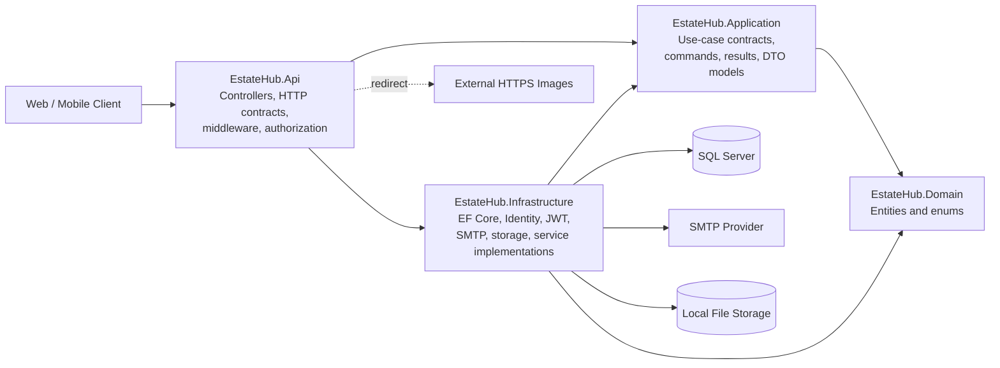
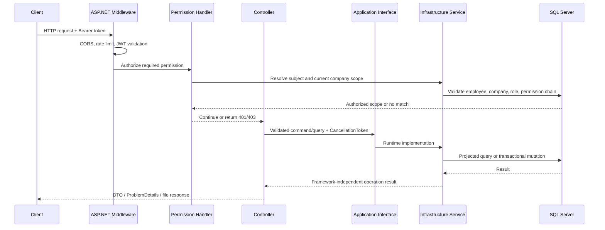

# EstateHub

> A production-oriented real-estate marketplace backend for property discovery, company operations, bookings, CRM, subscriptions, promotions, billing, file delivery, and platform moderation.

[](https://dotnet.microsoft.com/)
[](https://learn.microsoft.com/aspnet/core/)
[](https://learn.microsoft.com/ef/core/)
[](https://www.microsoft.com/sql-server)
[](LICENSE)

[Live frontend](https://e-statehub.vercel.app) · [Deployed API](https://estatehub.runasp.net) · [API reference](docs/API_MASTER_REFERENCE.md) · [Endpoint matrix](docs/API_ENDPOINT_MATRIX.md)

---

## Table of contents

- [Overview](#overview)
- [What the system covers](#what-the-system-covers)
- [Architecture](#architecture)
- [Request flow](#request-flow)
- [Patterns and engineering decisions](#patterns-and-engineering-decisions)
- [Technology stack](#technology-stack)
- [Domain and persistence](#domain-and-persistence)
- [Authentication, authorization, and tenancy](#authentication-authorization-and-tenancy)
- [API surface](#api-surface)
- [Project structure](#project-structure)
- [Getting started](#getting-started)
- [Configuration](#configuration)
- [Database migrations](#database-migrations)
- [Running the API](#running-the-api)
- [Testing](#testing)
- [File storage and delivery](#file-storage-and-delivery)
- [Operational and security notes](#operational-and-security-notes)
- [Documentation](#documentation)
- [Current limitations and honest caveats](#current-limitations-and-honest-caveats)
- [Contributing](#contributing)
- [License](#license)

## Overview

EstateHub is a multi-tenant real-estate platform backend built with ASP.NET Core and SQL Server. It serves three distinct audiences:

1. **Public visitors and customers** discover verified companies, projects, units, listings, viewing slots, reviews, subscription plans, and promotion packages.
2. **Company employees** manage the current company's profile, roles, employees, projects, units, listings, bookings, leads, promotions, subscriptions, and billing through database-backed permissions.
3. **Platform administrators** review company applications and moderate company reviews through a separate platform-level authorization policy.

The backend deliberately keeps transport concerns, application contracts, business data, and infrastructure code separated. It exposes **164 distinct HTTP verb/route pairs** across **32 controllers**, with a source-reconciled API reference under [`docs/`](docs/).

## What the system covers

| Area | Capabilities |
|---|---|
| Identity and accounts | Customer registration, email confirmation, login, refresh-token rotation, logout, password recovery, and authenticated profile management |
| Public marketplace | Company directory, projects, listing search and details, promoted listings, viewing slots, reviews, and catalog lookups |
| Customer workspace | Favorites, saved searches, viewing bookings, reviews, notifications, company applications, and private file ownership |
| Company access | Current-company context resolved from the authenticated employee membership; no client-supplied tenant ID is trusted |
| Company administration | Company profile, employees, roles, and an 18-code permission catalog |
| Inventory | Projects, amenities, media, nearby places, units, payment plans, listings, and listing lifecycle management |
| Operations | Viewing-slot scheduling, booking workflows, employee assignment, lead CRM, and customer conversion |
| Commercial features | Subscription plans, company subscriptions, promotion packages, listing promotions, invoices, invoice lines, and booking-charge settlement |
| Platform operations | Company-application review and company-review moderation using a dedicated `PlatformAdmin` role |
| Files | Secure image/PDF upload, owner-only metadata and content, anonymous public-image delivery, local storage, and HTTPS external-image redirects |

Features that have no authoritative Domain source are not fabricated. The API does not invent AI scores, ROI figures, market valuations, or recommendation data.

## Architecture

EstateHub uses a **Clean Architecture-inspired, four-layer structure** with feature-oriented slices inside each layer.



### Layer responsibilities

| Project | Responsibility | May depend on |
|---|---|---|
| `EstateHub.Domain` | Entities and business enums. No ASP.NET Core, EF Core, SQL Server, or Identity dependencies. | Nothing outside the base class library |
| `EstateHub.Application` | Framework-independent use-case interfaces, commands, query models, and operation results. | `EstateHub.Domain` |
| `EstateHub.Infrastructure` | EF Core persistence, Identity stores, JWT generation, SMTP, local file storage, and concrete application-service implementations. | `EstateHub.Application`, `EstateHub.Domain` |
| `EstateHub.Api` | Controllers, HTTP request/response contracts, model validation, CORS, rate limiting, Swagger, and policy wiring. It is the composition root. | `EstateHub.Application`, `EstateHub.Infrastructure` |

The architecture is intentionally practical rather than ceremonial: the API references Infrastructure only to compose the application, while controllers consume Application interfaces instead of querying `EstateHubDbContext` directly.

## Request flow

An authenticated company operation follows this path:



Public endpoints skip the authenticated tenant-resolution steps but still enforce publication and eligibility rules in their query services.

## Patterns and engineering decisions

### Feature-oriented application services

Each business area exposes focused interfaces in Application and implements them in Infrastructure. Examples include company projects, listings, viewing bookings, subscriptions, files, notifications, and platform moderation.

This is **not** a generic-repository architecture. EF Core already provides repository-like `DbSet<T>` access and unit-of-work behavior through `DbContext`; adding a generic repository would mostly duplicate it. EstateHub instead uses use-case-specific services and projections.

### Projection-first reads

Read paths use asynchronous EF Core queries, `AsNoTracking`, selective projections, pagination, and cancellation tokens. Large entity graphs are not loaded merely to shape an API response.

### Explicit write workflows

Multi-step operations use explicit transactions where atomicity matters. State transitions, tenant checks, uniqueness rules, and rowversion comparisons are handled before committing.

### Optimistic concurrency

Mutable business records use SQL Server `rowversion`. The HTTP contract transports rowversions as Base64 strings, allowing stale writes to return a conflict instead of silently overwriting newer data.

### Explicit enum transport

Public enum values are converted through focused mappings. The project does not enable a global `JsonStringEnumConverter`, which keeps each API contract deliberate and rejects unsupported values explicitly.

### Problem-oriented HTTP responses

Controllers use standard status codes and `ProblemDetails` / `ValidationProblemDetails` rather than leaking exceptions or persistence details. Unavailable public resources generally use generic `404` responses so hidden lifecycle or eligibility states are not disclosed.

### Database-backed authorization

Company permissions are not embedded in long-lived JWT claims. Permission revocation, employee suspension, and company suspension can affect the next request because authorization resolves the active chain from the database.

## Technology stack

| Component | Technology |
|---|---|
| Runtime | .NET SDK `10.0.302`, target framework `net10.0` |
| API | ASP.NET Core Web API |
| Persistence | Entity Framework Core `10.0.10` |
| Database | Microsoft SQL Server |
| Identity | ASP.NET Core Identity with `Guid` keys |
| Authentication | JWT bearer access tokens and persisted refresh sessions |
| Authorization | ASP.NET Core policy-based authorization with custom providers and handlers |
| Email | MailKit `4.17.0`, SMTP with required STARTTLS |
| API documentation | Swashbuckle `10.2.3` / Swagger UI |
| Tests | xUnit, `Microsoft.AspNetCore.Mvc.Testing`, and SQL Server integration databases |
| File storage | Local filesystem abstraction plus controlled HTTPS external-image redirects |

## Domain and persistence

The current backend contains:

- **49 Domain entities**
- **33 Domain enums**
- **49 Fluent API entity configurations**
- **4 logical EF Core migrations**
- **1 model snapshot**

### Domain areas

| Area | Examples |
|---|---|
| Companies and access | `Company`, `CompanyEmployee`, `CompanyRole`, `Permission`, `CompanyApplication`, `FileAsset` |
| Catalog and inventory | `Location`, `Currency`, `Amenity`, `UnitType`, `Project`, `Unit`, `Listing`, `PaymentPlan` |
| Discovery | Listing media, amenities, nearby places, favorites, saved searches, views, and reviews |
| Bookings and CRM | Viewing slots, viewing bookings, booking charges, leads, notes, and assignments |
| Billing and growth | Subscription plans, company subscriptions, promotion packages, listing promotions, invoices, and invoice lines |
| Users and security | Identity user data, refresh sessions, security events, and notifications |

The complete model is available as an editable draw.io diagram: [`ERD/ESTATEHUB_MVP_ERD_IMPLEMENTATION_READY.drawio`](ERD/ESTATEHUB_MVP_ERD_IMPLEMENTATION_READY.drawio).

## Authentication, authorization, and tenancy

### Authentication

- Access tokens are signed with HMAC SHA-256.
- JWT issuer, audience, signature, lifetime, and algorithm are validated.
- The signing key must contain at least 32 UTF-8 bytes.
- Inbound claim remapping is disabled; the authenticated user ID is read from the exact `sub` claim.
- Refresh sessions are persisted and support rotation/revocation.
- Identity requires unique and confirmed email addresses.
- Passwords require at least eight characters with uppercase, lowercase, and a digit.
- Accounts are locked for five minutes after five failed access attempts.

### Company permissions

Company authorization uses policies in this format:

```text
CompanyPermission:<permission-code>
```

There are exactly 18 stable permission codes: read/manage pairs for company profile, employees, roles, projects, units, listings, bookings, leads, and billing.

The authorization handler validates all of the following on each request:

- authenticated `sub` claim is a valid non-empty `Guid`;
- employee membership is active;
- company is active and verified;
- role assignment and permission chain are active and not revoked;
- permission code matches exactly using ordinal comparison.

The effective company is never accepted from route, query string, or request body.

### Platform administration

Platform operations use a separate deterministic Identity role named `PlatformAdmin`. Company permissions do not grant platform access, and platform access does not imply membership in any company.

## API surface

The current source contains **164 distinct HTTP verb/route pairs with zero duplicates**:

| Access class | Route count | Typical prefixes |
|---|---:|---|
| Anonymous/public | 26 | `/api/auth`, `/api/catalog`, `/api/companies`, `/api/listings`, `/api/files` |
| Authenticated customer/company | 127 | `/api/me`, `/api/company` |
| Platform administrator | 11 | `/api/platform` |
| **Total** | **164** | 32 controllers |

Rather than duplicating 164 routes here, the repository keeps source-reconciled references:

- [`API_MASTER_REFERENCE.md`](docs/API_MASTER_REFERENCE.md) — endpoint-by-endpoint behavior, validation, persistence, side effects, and examples.
- [`API_ENDPOINT_MATRIX.md`](docs/API_ENDPOINT_MATRIX.md) — compact route, access, policy, input, success, and error matrix.
- [`API_CONTRACTS_REFERENCE.md`](docs/API_CONTRACTS_REFERENCE.md) — reusable request/response contracts, validation messages, and all Domain enums.

### HTTP behavior

| Status | Meaning |
|---|---|
| `200 OK` | Successful query or update returning a representation |
| `201 Created` | Resource created successfully |
| `202 Accepted` | Enumeration-safe workflow accepted, such as selected email operations |
| `204 No Content` | Successful command with no response body |
| `400 Bad Request` | Binding, validation, or invalid transition error |
| `401 Unauthorized` | Missing, invalid, or expired authentication |
| `403 Forbidden` | Authenticated principal lacks the current permission or platform role |
| `404 Not Found` | Resource is missing or intentionally unavailable to the caller |
| `409 Conflict` | Uniqueness, state, rowversion, or concurrent-write conflict |
| `429 Too Many Requests` | Authentication rate limit exceeded |
| `503 Service Unavailable` | Required external delivery dependency failed |

## Project structure

```text
EstateHub/
├── src/
│   ├── EstateHub.Domain/
│   │   ├── Entities/
│   │   └── Enums/
│   ├── EstateHub.Application/
│   │   └── <feature>/              # Interfaces, commands, models, results
│   ├── EstateHub.Infrastructure/
│   │   ├── <feature>/              # EF-backed implementations
│   │   ├── Authentication/
│   │   ├── Email/
│   │   ├── Files/
│   │   ├── Identity/
│   │   └── Persistence/
│   │       ├── Configurations/
│   │       └── Migrations/
│   └── EstateHub.Api/
│       ├── Authorization/
│       ├── Contracts/
│       ├── Controllers/
│       ├── RateLimiting/
│       └── Program.cs
├── tests/
│   └── EstateHub.IntegrationTests/
├── docs/
├── ERD/
├── EstateHub.slnx
├── global.json
└── README.md
```

## Getting started

### Prerequisites

- [.NET SDK 10.0.302](https://dotnet.microsoft.com/download)
- SQL Server reachable by the API
- `dotnet-ef` `10.0.10` for migration commands
- An SMTP account that supports STARTTLS
- Git

Verify the selected toolchain:

```powershell
dotnet --version
dotnet ef --version
```

Expected versions:

```text
10.0.302
Entity Framework Core .NET Command-line Tools 10.0.10
```

Clone and restore:

```powershell
git clone https://github.com/AhmedSaad-EGY/EStateHub.git
Set-Location EStateHub
dotnet restore EstateHub.slnx
```

## Configuration

The API validates critical options at startup and fails fast when required configuration is absent or invalid. Keep credentials out of committed files.

### Required values

| Key | Purpose | Rule |
|---|---|---|
| `ConnectionStrings:DefaultConnection` | SQL Server access | Required, non-blank |
| `Jwt:SigningKey` | HMAC SHA-256 signing | At least 32 UTF-8 bytes |
| `Jwt:Issuer` | JWT issuer | Required |
| `Jwt:Audience` | JWT audience | Required |
| `Email:Username` | SMTP authentication | Required |
| `Email:Password` | SMTP authentication | Required |
| `Email:FromAddress` | Sender mailbox | Valid email address |
| `Frontend:BaseUrl` | Confirmation/reset links | Absolute HTTP or HTTPS URL |

Issuer, audience, token lifetimes, SMTP host/port, legal-policy versions, rate limits, storage limits, and allowed CORS origins already have non-secret defaults in `appsettings.json`.

### Development secrets

Use ASP.NET Core User Secrets for local credentials:

```powershell
$apiProject = "src/EstateHub.Api/EstateHub.Api.csproj"

dotnet user-secrets set "ConnectionStrings:DefaultConnection" "<SQL_SERVER_CONNECTION_STRING>" --project $apiProject
dotnet user-secrets set "Jwt:SigningKey" "<RANDOM_SECRET_WITH_AT_LEAST_32_BYTES>" --project $apiProject
dotnet user-secrets set "Email:Username" "<SMTP_USERNAME>" --project $apiProject
dotnet user-secrets set "Email:Password" "<SMTP_PASSWORD>" --project $apiProject
dotnet user-secrets set "Email:FromAddress" "<NO_REPLY_ADDRESS>" --project $apiProject
dotnet user-secrets set "Frontend:BaseUrl" "http://localhost:5173" --project $apiProject
```

For deployed environments, provide the same keys through the hosting platform's secret/configuration system. Environment-variable keys use double underscores, for example:

```text
ConnectionStrings__DefaultConnection
Jwt__SigningKey
Email__Username
Email__Password
Email__FromAddress
Frontend__BaseUrl
```

Never commit production credentials, export User Secrets, or pass a database password on a shared command line.

### CORS

`Cors:AllowedOrigins` must contain one or more exact absolute origins without trailing slashes. The checked-in defaults currently allow:

```text
http://localhost:5173
https://e-statehub.vercel.app
```

The policy allows all request headers and methods but does not enable arbitrary origins.

### Authentication rate limits

Authentication endpoints use fixed-window, IP-partitioned policies:

| Policy | Permit limit | Window |
|---|---:|---:|
| Registration | 5 | 10 minutes |
| Login | 10 | 1 minute |
| Email delivery | 3 | 15 minutes |
| Token lifecycle | 30 | 1 minute |
| Verification | 10 | 10 minutes |

Rejected requests return `429` with `application/problem+json` and `Retry-After` when available.

## Database migrations

The current migration chain is:

1. `20260807115808_InitialCreate`
2. `20260809220431_SeedCompanyPermissionCatalog`
3. `20260814114249_AddFileAssetOriginalFileName`
4. `20260815110144_SeedPlatformAdminRole`

After reviewing the schema warning below and configuring the target connection, migrations are normally applied with:

```powershell
dotnet ef database update `
  --project src/EstateHub.Infrastructure `
  --startup-project src/EstateHub.Api `
  --context EstateHubDbContext
```

Check model parity with:

```powershell
dotnet ef migrations has-pending-model-changes `
  --project src/EstateHub.Infrastructure `
  --startup-project src/EstateHub.Api `
  --context EstateHubDbContext
```

> [!WARNING]
> The current source maps nullable `FileAsset.ExternalUrl` as `nvarchar(2048)`, while the four committed migrations do not create that column. The deployed database received it through a controlled manual schema change. A fresh database created from migrations alone will therefore not match the current runtime model. Reconcile this with a reviewed migration before provisioning a new environment, and do not blindly add the column to an existing database where it is already present.

## Running the API

Run from the repository root:

```powershell
dotnet run --project src/EstateHub.Api
```

The launch profile opens Swagger by default. Swagger is available at:

```text
https://localhost:<port>/swagger
```

Build without starting the API:

```powershell
dotnet build EstateHub.slnx
```

## Testing

Run the integration suite:

```powershell
dotnet test tests/EstateHub.IntegrationTests/EstateHub.IntegrationTests.csproj
```

The test foundation:

- uses xUnit and `WebApplicationFactory<Program>`;
- replaces production authentication with a deterministic test scheme;
- creates a uniquely named SQL Server database for a run;
- applies the EF migration chain;
- exercises authorization and notification behavior;
- drops only a database whose name matches the guarded `EstateHubTests_<32 hex characters>` pattern.

Tests currently expect a local default SQL Server instance through:

```text
Server=.;Integrated Security=True;Encrypt=False;
```

Do not run the suite on a machine where `Server=.` resolves to a shared or production SQL Server.

## File storage and delivery

New uploads use the configured local storage abstraction:

```json
{
  "FileStorage": {
    "RootPath": "App_Data/Files",
    "MaximumImageBytes": 10485760,
    "MaximumDocumentBytes": 20971520
  }
}
```

The file workflow includes content-type and magic-byte validation, safe server-generated storage keys, owner-only metadata/content access, public-image eligibility checks, and guarded deletion of unreferenced assets.

`GET /api/files/{fileAssetId}` keeps one stable public contract:

- local uploaded files continue through `StorageKey` and local storage;
- records with a non-empty `ExternalUrl` redirect only when the value is an absolute HTTPS URI;
- relative URLs and `http:`, `javascript:`, `file:`, and `data:` schemes are rejected;
- external URLs are not accepted from the upload API.

## Operational and security notes

- Secrets are expected through User Secrets or environment configuration, not source control.
- SMTP uses STARTTLS; certificate validation is not bypassed.
- CORS uses an explicit origin allowlist.
- Authentication endpoints are rate-limited.
- Company authorization is tenant-safe and database-backed.
- Platform authorization is isolated from company RBAC.
- Sensitive fields such as passwords, tokens, storage keys, uploader details, and internal status data are not exposed by public contracts.
- Public listing/company/project queries enforce publication, verification, company-status, and subscription-aware eligibility rules.
- Cancellation tokens flow from controllers into asynchronous database and external-service operations.
- Multi-step mutations use transactions where partial completion would corrupt business state.
- Application and database failures are not converted into misleading success responses.

Recommended deployment checks:

1. Use a least-privilege SQL login and encrypted transport.
2. Supply all secrets through the host's secret store.
3. Review the exact migration script before applying it.
4. Reconcile `FileAsset.ExternalUrl` before provisioning a fresh database.
5. Configure trusted forwarded headers before relying on client IP partitioning behind a reverse proxy.
6. Decide whether Swagger should remain publicly enabled; the current source enables it in every environment.
7. Ensure the file-storage directory is persistent, writable only by the application identity, and excluded from source control.
8. Monitor SMTP, database connectivity, authorization failures, and rate-limit rejections without logging credentials or message contents.

## Documentation

| Document | Purpose |
|---|---|
| [`API_MASTER_REFERENCE.md`](docs/API_MASTER_REFERENCE.md) | Canonical endpoint-by-endpoint reference for all 164 routes |
| [`API_ENDPOINT_MATRIX.md`](docs/API_ENDPOINT_MATRIX.md) | Compact route/access/policy/result matrix |
| [`API_CONTRACTS_REFERENCE.md`](docs/API_CONTRACTS_REFERENCE.md) | Request/response models, validation messages, and enum catalog |
| [`API_INTEGRATION_AND_TESTING_GUIDE.md`](docs/API_INTEGRATION_AND_TESTING_GUIDE.md) | Frontend integration, auth/RBAC behavior, lifecycle maps, transactions, and QA guidance |
| [`API_DOCUMENTATION_FINDINGS.md`](docs/API_DOCUMENTATION_FINDINGS.md) | Source-backed gaps and operational findings that should not be hidden |
| [`ESTATEHUB_MVP_ERD_IMPLEMENTATION_READY.drawio`](ERD/ESTATEHUB_MVP_ERD_IMPLEMENTATION_READY.drawio) | Editable entity-relationship diagram |

The documentation was reconciled against the current controller source with these results:

```text
HTTP-mapped action methods:   164
HTTP mapping attributes:      164
Effective verb/route pairs:   164
Distinct verb/route pairs:    164
Duplicate verb/route pairs:     0
```

## Current limitations and honest caveats

This repository is substantial, but it is not honest to present it as finished in every operational dimension:

- `FileAsset.ExternalUrl` currently has a model-to-migration gap, explained in [Database migrations](#database-migrations).
- Swagger is currently enabled outside Development because the environment guard in `Program.cs` is commented out.
- Rate limiting partitions by `HttpContext.Connection.RemoteIpAddress`, while trusted forwarded-header configuration is not visible in the current source. Reverse-proxy deployments must address this deliberately.
- The permanent automated test suite currently concentrates on authorization and notification behavior; it does not yet provide comprehensive coverage for all 164 routes.
- Local file storage requires persistent host storage or a deliberate move to object storage for horizontally scaled deployments.
- Deployment automation and CI status are not represented by a committed workflow, so this README intentionally does not display a fake build badge.

See [`API_DOCUMENTATION_FINDINGS.md`](docs/API_DOCUMENTATION_FINDINGS.md) for the full source-backed findings list.

## Contributing

1. Create a focused branch from `main`.
2. Keep changes within the existing four-layer dependency direction.
3. Add contracts to Application and implementations to Infrastructure; do not move EF Core into Application or API controllers.
4. Preserve tenant resolution from the authenticated subject instead of accepting a company ID from client input.
5. Add or update tests for behavior changes.
6. Run restore, build, tests, and the pending-model check.
7. Update the canonical API documentation when routes or contracts change.
8. Open a pull request describing behavior, security impact, schema impact, and verification evidence.

## License

EstateHub is licensed under the [MIT License](LICENSE).

## Author

Built by [Ahmed Saad](https://github.com/AhmedSaad-EGY).
