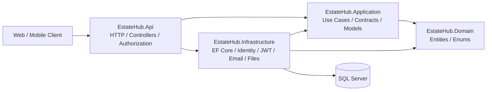

# 🏠 EstateHub

> Production-oriented real estate marketplace backend built with **ASP.NET Core**, **SQL Server**, and a Clean Architecture-inspired design.

[](https://dotnet.microsoft.com/)
[](https://learn.microsoft.com/aspnet/core/)
[](https://learn.microsoft.com/ef/core/)
[](https://www.microsoft.com/sql-server)
[](LICENSE)

### 🔗 Links

- **Live Frontend:** https://e-statehub.vercel.app
- **Deployed API:** https://estatehub.runasp.net
- **API Reference:** [API_MASTER_REFERENCE.md](API_MASTER_REFERENCE.md)
- **Endpoint Matrix:** [API_ENDPOINT_MATRIX.md](API_ENDPOINT_MATRIX.md)

---

## 📌 Overview

**EstateHub** is a multi-tenant real estate platform backend designed around real business workflows rather than simple CRUD operations.

The platform supports three main groups:

- **Customers and public visitors** searching for companies, projects, properties, listings, reviews, and viewing opportunities.
- **Real estate companies** managing employees, permissions, projects, units, listings, leads, bookings, subscriptions, promotions, and billing.
- **Platform administrators** reviewing company applications and moderating platform-level operations.

The backend currently exposes a large REST API surface with **164 distinct HTTP verb/route pairs across 32 controllers**.

The project focuses heavily on:

- Multi-tenant authorization
- Database-backed permissions
- Secure authentication
- Business workflow modeling
- Optimistic concurrency
- Transactional operations
- Efficient EF Core querying
- API contract design
- Production-oriented configuration

---

# ✨ Key Engineering Highlights

### 🔐 Multi-Tenant Authorization

Company access is resolved from the authenticated user's active employee membership.

The backend **does not trust a company ID sent by the client** to determine tenant scope.

Each protected company request validates the complete authorization chain:

```text
Authenticated User
        ↓
Active Employee Membership
        ↓
Active & Verified Company
        ↓
Active Company Role
        ↓
Assigned Permission
        ↓
Requested Operation
```

Permission changes can affect the next request because authorization is resolved from the database rather than being permanently embedded inside long-lived JWT claims.

---

### 🛡️ Fine-Grained RBAC

EstateHub uses policy-based authorization with a stable permission catalog.

Examples:

```text
CompanyPermission:company.read
CompanyPermission:company.manage

CompanyPermission:employees.read
CompanyPermission:employees.manage

CompanyPermission:projects.read
CompanyPermission:projects.manage

CompanyPermission:listings.read
CompanyPermission:listings.manage

CompanyPermission:bookings.read
CompanyPermission:bookings.manage

CompanyPermission:billing.read
CompanyPermission:billing.manage
```

Platform administration is separated from company-level permissions through a dedicated:

```text
PlatformAdmin
```

role.

---

### 🔑 Authentication & Session Management

The authentication system includes:

- ASP.NET Core Identity
- JWT bearer access tokens
- Persisted refresh sessions
- Refresh-token rotation and revocation
- Email confirmation
- Password recovery
- Account lockout protection
- Unique confirmed email addresses
- Short-lived access tokens
- Separate "Remember Me" refresh lifetime

Authentication endpoints are protected by dedicated rate-limiting policies.

---

### 🚦 Authentication Rate Limiting

Different sensitive operations use different fixed-window limits.

| Operation | Limit | Window |
|---|---:|---:|
| Registration | 5 | 10 minutes |
| Login | 10 | 1 minute |
| Email Delivery | 3 | 15 minutes |
| Token Lifecycle | 30 | 1 minute |
| Verification | 10 | 10 minutes |

This prevents one global rate limit from treating every authentication operation the same way.

---

### ⚡ Projection-First EF Core Queries

Read-heavy endpoints avoid loading unnecessary entity graphs.

The backend uses:

- `AsNoTracking()`
- Selective projections
- Async EF Core queries
- Pagination
- Cancellation tokens
- Purpose-specific query services

This keeps read models separate from persistence entities and reduces unnecessary database and memory overhead.

---

### 🔄 Optimistic Concurrency

Mutable business records use SQL Server:

```text
rowversion
```

for optimistic concurrency.

Row versions are transported through the HTTP API as Base64 values.

When a client attempts to update stale data, the API can return:

```text
409 Conflict
```

instead of silently overwriting a newer change.

---

### 💳 Transactional Business Workflows

Operations that involve multiple state changes use explicit database transactions when partial completion would leave the system inconsistent.

Examples include workflows around:

- Billing
- Subscriptions
- Promotions
- Bookings
- Company operations
- Listing lifecycle changes

---

### 📦 Secure File Handling

EstateHub contains a controlled file-storage workflow for images and PDF documents.

The implementation includes:

- Configurable file-size limits
- Content-type validation
- Magic-byte validation
- Server-generated storage keys
- Owner-only private-file access
- Controlled public-image access
- Guarded asset deletion
- HTTPS-only external image redirects

Potentially dangerous schemes such as:

```text
javascript:
file:
data:
http:
```

are rejected for externally redirected assets.

---

# 🧩 Platform Capabilities

| Area | Capabilities |
|---|---|
| **Identity** | Registration, login, email confirmation, refresh sessions, password recovery, profile management |
| **Companies** | Company profiles, verification, applications and company management |
| **Employees** | Employee membership, roles and permission assignment |
| **Catalog** | Locations, currencies, amenities and property-related lookup data |
| **Projects** | Real estate projects, media, amenities and nearby locations |
| **Units** | Unit inventory, types and payment-plan relationships |
| **Listings** | Property listings, lifecycle management, promotion and search |
| **Discovery** | Public projects, companies, listings and promoted content |
| **Customers** | Favorites, saved searches, profile operations and notifications |
| **Viewing** | Viewing slots and booking workflows |
| **CRM** | Leads, notes, assignment and customer-conversion workflows |
| **Reviews** | Reviews and platform moderation |
| **Subscriptions** | Subscription plans and company subscriptions |
| **Promotions** | Promotion packages and promoted listings |
| **Billing** | Invoices, invoice lines and commercial workflows |
| **Files** | Private assets, public images and controlled file delivery |
| **Platform Admin** | Company-application review and review moderation |

---

# 🏗️ Architecture

EstateHub uses a **Clean Architecture-inspired four-layer structure**.



## Dependency Direction

```text
EstateHub.Api
    ├── EstateHub.Application
    └── EstateHub.Infrastructure

EstateHub.Infrastructure
    ├── EstateHub.Application
    └── EstateHub.Domain

EstateHub.Application
    └── EstateHub.Domain

EstateHub.Domain
    └── No project dependencies
```

### `EstateHub.Domain`

Contains:

- Domain entities
- Business enums

It does not depend on:

- ASP.NET Core
- Entity Framework Core
- SQL Server
- Identity
- Infrastructure

---

### `EstateHub.Application`

Contains framework-independent application contracts such as:

- Use-case interfaces
- Commands
- Query models
- DTO models
- Operation results

Application depends only on:

```text
EstateHub.Domain
```

---

### `EstateHub.Infrastructure`

Contains concrete implementations for:

- Entity Framework Core
- SQL Server
- ASP.NET Core Identity
- JWT authentication
- SMTP email
- File storage
- Company services
- Listing services
- Billing
- Subscriptions
- Notifications
- Promotions
- Projects
- Viewing bookings
- Platform operations

---

### `EstateHub.Api`

Acts as the HTTP layer and composition root.

It contains:

- Controllers
- HTTP contracts
- CORS configuration
- Authentication wiring
- Authorization policies
- Custom authorization handlers
- Rate limiting
- Swagger
- Dependency registration

Controllers work against application-level contracts rather than directly querying the database.

---

# 🔁 Typical Request Flow

A protected company request follows roughly this flow:

```text
HTTP Request
     ↓
CORS / Rate Limiting
     ↓
JWT Authentication
     ↓
Authorization Policy
     ↓
Resolve User + Company Membership
     ↓
Validate Role + Permission
     ↓
Controller
     ↓
Application Contract
     ↓
Infrastructure Implementation
     ↓
EF Core / SQL Server
     ↓
Result
     ↓
HTTP Response
```

This design keeps:

```text
HTTP concerns
Business use cases
Persistence
Authentication infrastructure
Domain data
```

separated from one another.

---

# 🗄️ Persistence Design

EstateHub uses:

```text
Entity Framework Core 10
SQL Server
```

with Fluent API configurations.

Important persistence practices include:

- Explicit entity configuration
- SQL Server constraints
- Async queries
- Pagination
- Selective projections
- `AsNoTracking()` for read paths
- Explicit transactions
- Optimistic concurrency
- Migration-based schema management
- Cancellation-token propagation

The domain contains a substantial relational model covering companies, users, listings, projects, bookings, CRM, billing and platform operations.

---

# 🌐 API Design

EstateHub exposes REST endpoints across three major access classes.

| Access Level | Examples |
|---|---|
| **Public** | Authentication, catalogs, public companies, projects and listings |
| **Authenticated** | Customer workspace and company operations |
| **Platform Admin** | Company-application review and platform moderation |

Common response statuses include:

| Status | Usage |
|---|---|
| `200 OK` | Successful query/update |
| `201 Created` | Resource created |
| `202 Accepted` | Accepted workflow |
| `204 No Content` | Successful command without response body |
| `400 Bad Request` | Validation or invalid transition |
| `401 Unauthorized` | Authentication required or invalid |
| `403 Forbidden` | Insufficient permission |
| `404 Not Found` | Missing or unavailable resource |
| `409 Conflict` | State, uniqueness or concurrency conflict |
| `429 Too Many Requests` | Rate limit exceeded |
| `503 Service Unavailable` | External dependency failure |

Expected business failures are converted into HTTP responses rather than exposing infrastructure exceptions directly.

---

# 🛠️ Technology Stack

| Category | Technology |
|---|---|
| Language | C# |
| Runtime | .NET 10 |
| API | ASP.NET Core Web API |
| ORM | Entity Framework Core `10.0.10` |
| Database | Microsoft SQL Server |
| Identity | ASP.NET Core Identity |
| Authentication | JWT Bearer |
| Authorization | Policy-based authorization + custom handlers |
| Email | MailKit `4.17.0` |
| API Documentation | Swagger / Swashbuckle `10.2.3` |
| File Storage | Local filesystem abstraction |
| Architecture | Clean Architecture-inspired layered backend |

---

# 📁 Project Structure

```text
EstateHub/
│
├── src/
│   │
│   ├── EstateHub.Domain/
│   │   ├── Entities/
│   │   └── Enums/
│   │
│   ├── EstateHub.Application/
│   │   ├── Accounts/
│   │   ├── Authentication/
│   │   ├── Billing/
│   │   ├── CatalogLookups/
│   │   ├── Communications/
│   │   └── ...
│   │
│   ├── EstateHub.Infrastructure/
│   │   ├── Authentication/
│   │   ├── Identity/
│   │   ├── Persistence/
│   │   ├── Email/
│   │   ├── Files/
│   │   ├── Companies/
│   │   ├── Listings/
│   │   ├── Projects/
│   │   ├── Subscriptions/
│   │   ├── Notifications/
│   │   └── ...
│   │
│   └── EstateHub.Api/
│       ├── Authorization/
│       ├── Contracts/
│       ├── Controllers/
│       ├── RateLimiting/
│       ├── Program.cs
│       └── appsettings.json
│
├── API_MASTER_REFERENCE.md
├── API_ENDPOINT_MATRIX.md
├── API_CONTRACTS_REFERENCE.md
├── API_INTEGRATION_AND_TESTING_GUIDE.md
├── API_DOCUMENTATION_FINDINGS.md
├── EstateHub_Backend_Project_Handoff.md
├── EstateHub.slnx
├── global.json
├── LICENSE
└── README.md
```

---

# 🚀 Getting Started

## Prerequisites

You need:

```text
.NET 10 SDK
SQL Server
Git
```

EF Core CLI is also recommended:

```bash
dotnet tool install --global dotnet-ef
```

---

## Clone the Repository

```bash
git clone https://github.com/AhmedSaad-EGY/EStateHub.git
cd EStateHub
```

---

## Restore Dependencies

```bash
dotnet restore EstateHub.slnx
```

---

# ⚙️ Configuration

Secrets are intentionally not committed to source control.

The application expects values including:

```text
ConnectionStrings:DefaultConnection

Jwt:SigningKey
Jwt:Issuer
Jwt:Audience

Email:Username
Email:Password
Email:FromAddress

Frontend:BaseUrl
```

For local development, ASP.NET Core User Secrets can be used.

```powershell
$apiProject = "src/EstateHub.Api/EstateHub.Api.csproj"

dotnet user-secrets set "ConnectionStrings:DefaultConnection" "<SQL_SERVER_CONNECTION_STRING>" --project $apiProject

dotnet user-secrets set "Jwt:SigningKey" "<JWT_SIGNING_KEY_AT_LEAST_32_BYTES>" --project $apiProject

dotnet user-secrets set "Email:Username" "<SMTP_USERNAME>" --project $apiProject

dotnet user-secrets set "Email:Password" "<SMTP_PASSWORD>" --project $apiProject

dotnet user-secrets set "Email:FromAddress" "<FROM_EMAIL>" --project $apiProject

dotnet user-secrets set "Frontend:BaseUrl" "http://localhost:5173" --project $apiProject
```

For deployed environments, use the hosting platform's secret-management system.

Equivalent environment-variable names include:

```text
ConnectionStrings__DefaultConnection
Jwt__SigningKey
Email__Username
Email__Password
Email__FromAddress
Frontend__BaseUrl
```

---

# 🌍 CORS

The API validates configured origins during startup.

The checked-in development configuration currently allows:

```text
http://localhost:5173
```

Production origins should be supplied through deployment configuration.

Origins must be valid absolute origins without trailing slashes.

---

# 🗃️ Database Migrations

Apply the EF Core migration chain with:

```powershell
dotnet ef database update `
  --project src/EstateHub.Infrastructure `
  --startup-project src/EstateHub.Api `
  --context EstateHubDbContext
```

You can check for model changes with:

```powershell
dotnet ef migrations has-pending-model-changes `
  --project src/EstateHub.Infrastructure `
  --startup-project src/EstateHub.Api `
  --context EstateHubDbContext
```

---

# ▶️ Running the API

```bash
dotnet run --project src/EstateHub.Api
```

Swagger is available from the API's:

```text
/swagger
```

endpoint.

Build the complete solution with:

```bash
dotnet build EstateHub.slnx
```

---

# 📚 Documentation

The repository contains detailed documentation for deeper technical inspection.

### API Master Reference

```text
API_MASTER_REFERENCE.md
```

Detailed endpoint-by-endpoint API documentation.

---

### Endpoint Matrix

```text
API_ENDPOINT_MATRIX.md
```

Compact overview of:

- Routes
- HTTP methods
- Access requirements
- Policies
- Inputs
- Success responses
- Error behavior

---

### API Contracts Reference

```text
API_CONTRACTS_REFERENCE.md
```

Contains reusable:

- Request contracts
- Response contracts
- Validation information
- Domain enum references

---

### Integration & Testing Guide

```text
API_INTEGRATION_AND_TESTING_GUIDE.md
```

Documents frontend integration, authorization behavior, API lifecycles and recommended verification flows.

> This document is an integration/testing guide. A committed automated test project is not currently included in this repository.

---

### Documentation Findings

```text
API_DOCUMENTATION_FINDINGS.md
```

Tracks source-backed implementation findings and known gaps.

---

### Backend Project Handoff

```text
EstateHub_Backend_Project_Handoff.md
```

Contains deeper project context intended for technical handoff and continued development.

---

# 🔒 Security Considerations

EstateHub currently includes several defensive backend practices:

- JWT signature, issuer, audience and lifetime validation
- Persisted refresh-session lifecycle
- Database-backed authorization
- Tenant-safe company resolution
- Platform/company authorization separation
- Authentication endpoint rate limiting
- Explicit CORS allowlist
- Secrets outside source control
- Account lockout
- File magic-byte validation
- HTTPS-only external asset redirects
- Controlled public/private file access
- Optimistic concurrency
- Generic public `404` behavior where appropriate
- Transactional multi-step mutations

---

# ⚠️ Current Limitations

This project is actively evolving and does not attempt to hide unfinished operational work.

Current areas for improvement include:

- Automated test projects are not currently committed to the repository.
- A CI/CD workflow is not currently included.
- Swagger is currently enabled in all environments.
- Rate limiting currently relies on the direct connection IP; trusted forwarded-header configuration should be added when deploying behind a reverse proxy.
- Local file storage requires persistent host storage and would need to move to object storage for horizontal scaling.
- The current `FileAsset` runtime model contains an `ExternalUrl` mapping that should be reconciled cleanly with the committed migration history before provisioning a fresh production database.

These are tracked as engineering work rather than presented as completed features.

---

# 🗺️ Roadmap

Planned engineering improvements include:

- Expand automated unit and integration testing
- Add architecture dependency tests
- Introduce CI build and test validation
- Restrict Swagger by environment
- Add trusted proxy / forwarded-header configuration
- Move deployable file assets to object storage
- Improve observability and structured application logging
- Add health-check endpoints
- Strengthen deployment automation
- Continue database and query performance auditing

---

# 🤝 Contributing

When contributing:

1. Keep the existing dependency direction.
2. Keep Domain independent from infrastructure frameworks.
3. Define use-case contracts in Application.
4. Implement external concerns inside Infrastructure.
5. Keep controllers focused on HTTP concerns.
6. Never accept tenant identity directly from untrusted client input.
7. Review authorization impact when adding company operations.
8. Keep secrets out of source control.
9. Update the API documentation when contracts change.

---

# 📄 License

EstateHub is licensed under the [MIT License](LICENSE).

---

# 👨‍💻 Author

**Ahmed Saad**

Backend .NET Developer

- GitHub: https://github.com/AhmedSaad-EGY
- LinkedIn: https://www.linkedin.com/in/ahmed-mohamed-saad-b57695356/
